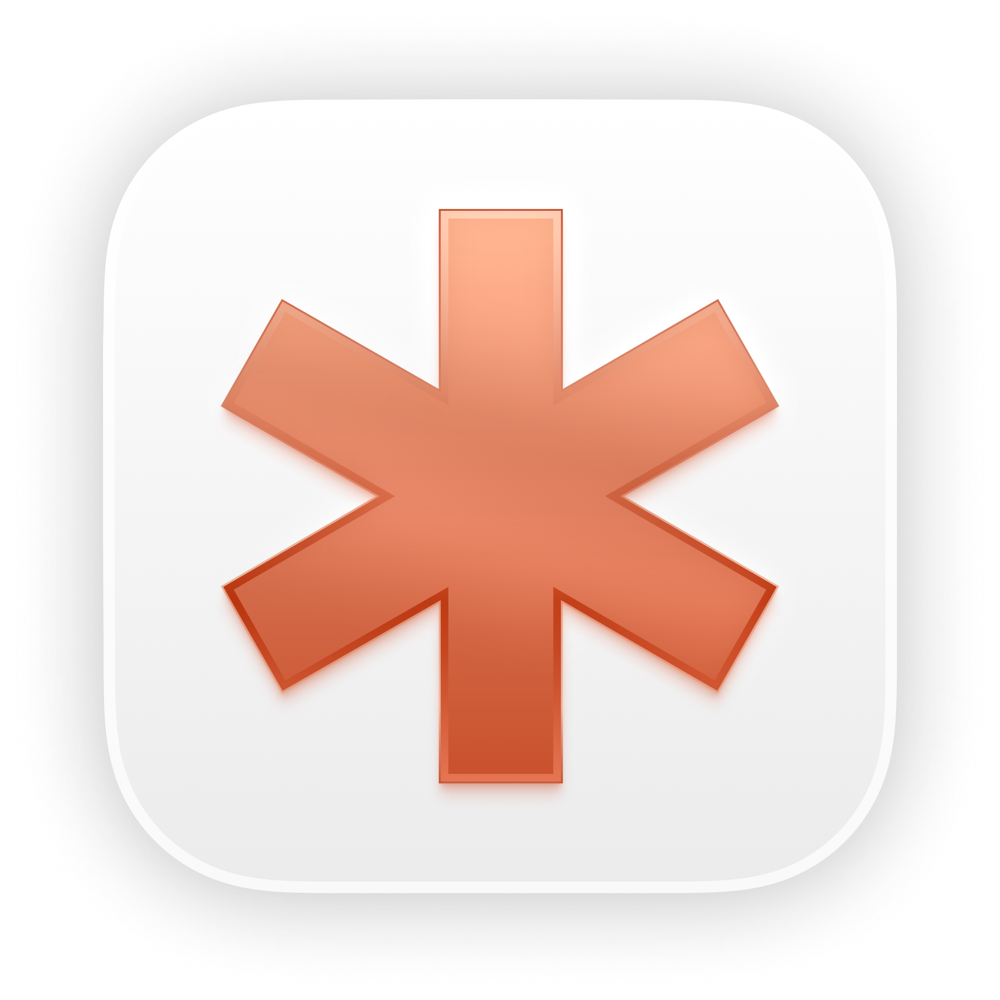

Jattends is a menubar app that tells you when your [Claude Code](https://docs.anthropic.com/en/docs/claude-code) sessions need attention.

*From French "j'attends" — "I'm waiting."*

## Install

```bash
git clone https://github.com/msllrs/jattends.git
cd jattends
bash scripts/install.sh
```

Grant **Accessibility** permission when prompted — this lets Jattends raise the correct terminal window when you click a session.

## How it works

Jattends uses Claude Code [hooks](https://docs.anthropic.com/en/docs/claude-code/hooks) to track session state. When something needs your attention — a tool approval, a question, an error — a badge appears in your menubar. Click a session to jump straight to the right terminal window, or approve permission requests without leaving what you're doing.


## Features

- **Approve from the menu bar** — when Claude asks for permission, answer Approve/Deny from a notification or the menu; no window switching. If you don't answer in time, the prompt appears in the terminal as usual
- **Live session states** — needs approval, waiting, error, working (with what it's doing: "Running: npm test", "Editing: Store.swift"), compacting, ready
- **Menubar badge** — see at a glance when any session needs you
- **Terminal focus** — click a session to raise the exact window/tab (OSC 2 title tagging, so two sessions in the same project resolve correctly)
- **Dismiss** — Option+click a session to dismiss it, or Option+click the header to clear all
- **Notifications** — native macOS notifications with the session's status and detail
- **Sound alerts** — play a system sound, with an option to repeat until dismissed
- **Global shortcut** — jump to the most recent waiting session from any app
- **Auto-clear** — automatically dismiss attention-needing sessions after a configurable timeout
- **Multi-terminal** — Ghostty, Terminal.app, iTerm2, kitty, Warp, Alacritty, WezTerm, Hyper, VS Code

In-app approvals are on by default. Notifications, sound, shortcut, and auto-clear are off by default. Configure in Settings (menubar icon → Settings).

## Raycast Extension

A companion [Raycast](https://www.raycast.com/) extension for fast fuzzy-search session switching. See [`raycast-extension/`](raycast-extension/) for setup.

## Requirements

- macOS 14+
- [Claude Code](https://docs.anthropic.com/en/docs/claude-code)
- Swift 5.10+ (Xcode 15.3+)

## Uninstall

```bash
bash scripts/uninstall.sh
```

## License

[MIT](LICENSE)
